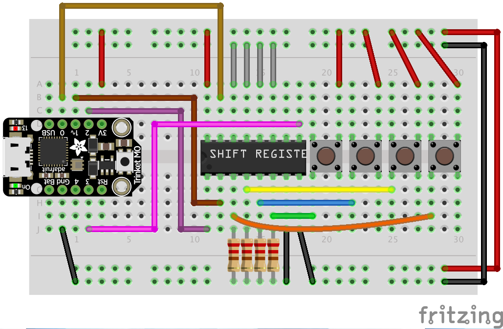

# Using the Trinket M0 with a 74HC165 Shift Register and the Keyboard Library

This code also uses the [ShiftIn](https://github.com/InfectedBytes/ArduinoShiftIn) library to make handling the shift register easy

Note that you can add 4 more binary inputs (on the pins shown connected to ground with the grey wires) for a total of 8.
