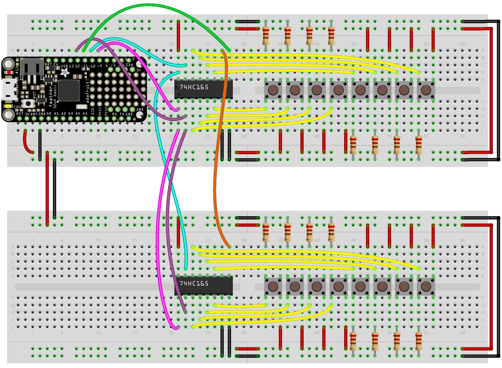

# Using a Feather with the 74HC165 Shift Register

This code uses the [ShiftIn](https://github.com/InfectedBytes/ArduinoShiftIn) library to make handling the shift register easy.

*If you are using platformio, be sure to add:*
`lib_deps = https://github.com/InfectedBytes/ArduinoShiftIn`
to the platformio.ini

## Single Shift in
The first example `feather_shift_in_single` is for using a single 74HC165 to add 4 additional inputs (the chip requires 4 to work, and gives you 8 total, hence 4)

## Multiple Shift in
The second example `feather_shift_in_multiple` shows how to use two 74HC165 to add 12 additional inputs (the chip requires 4 to work, and each shift register gives 8, so 12 total)

