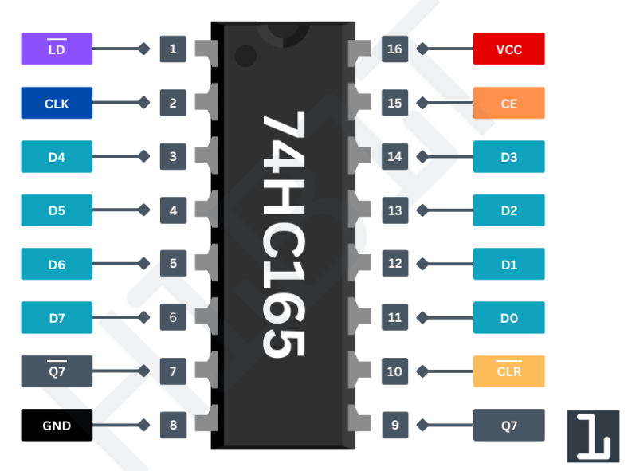
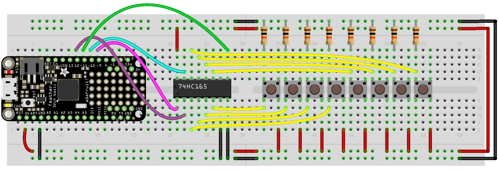
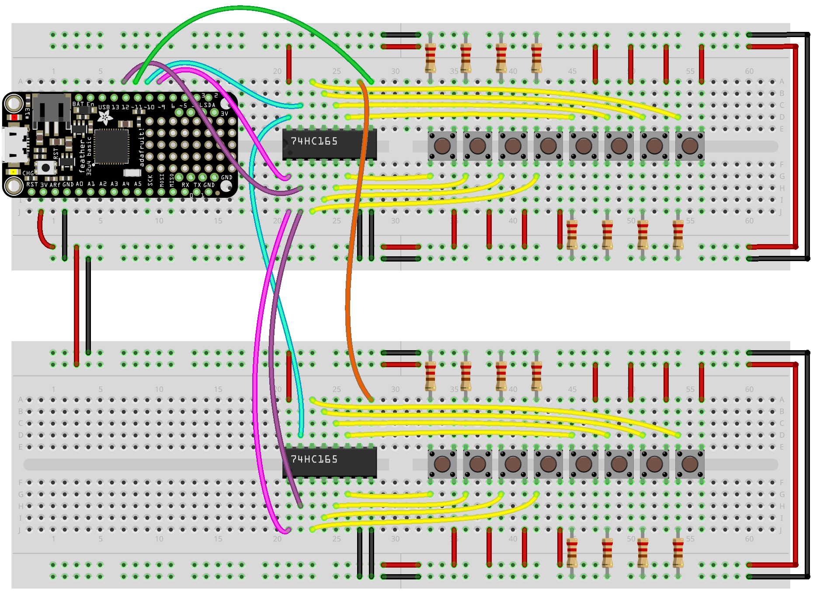

# Using a Feather with the 74HC165 Shift Register

This code uses the [ShiftIn](https://github.com/InfectedBytes/ArduinoShiftIn) library to make handling the shift register easy.

## 74HC165 Pinout

PIN Number
PIN Name

| PIN Number  | PIN Name | Description |
| ------------- | ------------- | ------------- |
| Pin 1 | LD | Active-low load pin, loads parallel data into the register when low
| Pin 2 | CLK | Clock input, shifts data out on the rising edge | 
| Pin 7 | Q7' | Additional serial data output for cascading multiple shift registers. | 
| Pin 8 | GND | Ground pin | 
| Pin 9 | Q7 | Serial data output pin, where the data is shifted out. | 
| Pin 10 | CLR | Active-low clear pin, resets all internal data when low. | 
| Pin 15 | CE | Disables the clock input when high, preventing data from being shifted. | 
| Pin 16 | VCC | Power supply pin (typically +5V) | 
| Pins 3-6, 11-14 | D0-D7 | Parallel input pins where the data is loaded into the shift register |

## Single Shift in
The first example `feather_shift_in_single` is for using a single 74HC165 to add 4 additional inputs (the chip requires 4 to work, and gives you 8 total, hence 4)

## Multiple Shift in
The second example `feather_shift_in_multiple` shows how to use two 74HC165 to add 12 additional inputs (the chip requires 4 to work, and each shift register gives 8, so 12 total)

### For PlatformIO

Be sure to add:

`lib_deps = https://github.com/InfectedBytes/ArduinoShiftIn`

to the platformio.ini to use the library

