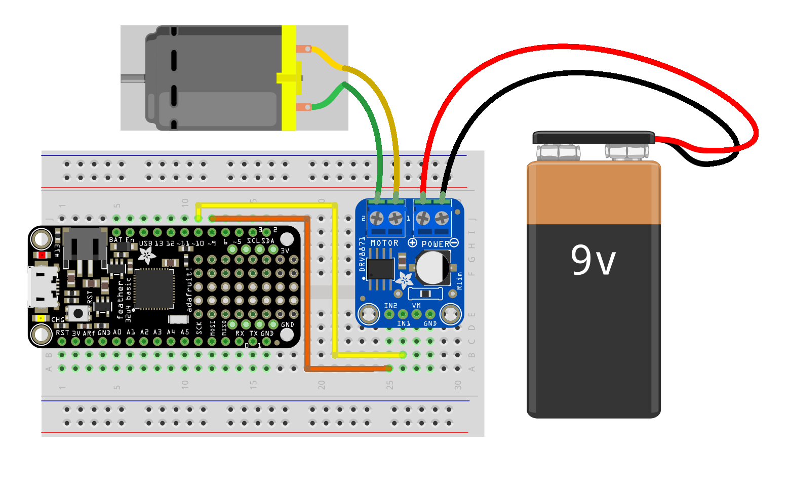

# Using the Feather 32u4 with the DRV8871 Motor Driver



To use this, you basically just set one pin high and the other low to drive in one direction, flip it to go the other way, set both high to brake, and both low to "coast." You can also use PWM to control speed.


| IN 1 | IN 2 | RESULT |
|------|------|--------|
| LOW | LOW | Coast |
| HIGH | LOW | Forward |
| LOW | HIGH | Reverse |
| HIGH | HIGH | Brake |


### Simple Forward and Reverse

```c
const int MOTOR_FORWARD_PIN = 9;
const int MOTOR_REVERSE_PIN = 10;

void setup() {
  pinMode(MOTOR_FORWARD_PIN, OUTPUT);
  pinMode(MOTOR_REVERSE_PIN, OUTPUT);
}

void loop() {
  forward();
  delay(1000);

  coast();
  delay(1000);

  reverse();
  delay(1000);

  coast();
  delay(1000);
}

void forward() {
  digitalWrite(MOTOR_FORWARD_PIN, HIGH);
  digitalWrite(MOTOR_REVERSE_PIN, LOW);
}

void reverse() {
  digitalWrite(MOTOR_FORWARD_PIN, LOW);
  digitalWrite(MOTOR_REVERSE_PIN, HIGH);
}

void coast() {
  digitalWrite(MOTOR_FORWARD_PIN, LOW);
  digitalWrite(MOTOR_REVERSE_PIN, LOW);
}

void brake() {
  digitalWrite(MOTOR_FORWARD_PIN, HIGH);
  digitalWrite(MOTOR_REVERSE_PIN, HIGH);
}


```


### Speed Control

```c
const int MOTOR_IN1 = 9;
const int MOTOR_IN2 = 10;

void setup() {
  pinMode(MOTOR_IN1, OUTPUT);
  pinMode(MOTOR_IN2, OUTPUT);
}

void loop() {
  // ramp up forward
  digitalWrite(MOTOR_IN1, LOW);
  for (int i = 0; i < 255; i++) {
    analogWrite(MOTOR_IN2, i);
    delay(10);
  }

  // forward full speed for one second
  delay(1000);

  // ramp down forward
  for (int i = 255; i >= 0; i--) {
    analogWrite(MOTOR_IN2, i);
    delay(10);
  }

  // ramp up backward
  digitalWrite(MOTOR_IN2, LOW);
  for (int i = 0; i < 255; i++) {
    analogWrite(MOTOR_IN1, i);
    delay(10);
  }

  // backward full speed for one second
  delay(1000);

  // ramp down backward
  for (int i = 255; i >= 0; i--) {
    analogWrite(MOTOR_IN1, i);
    delay(10);
  }
}

```

