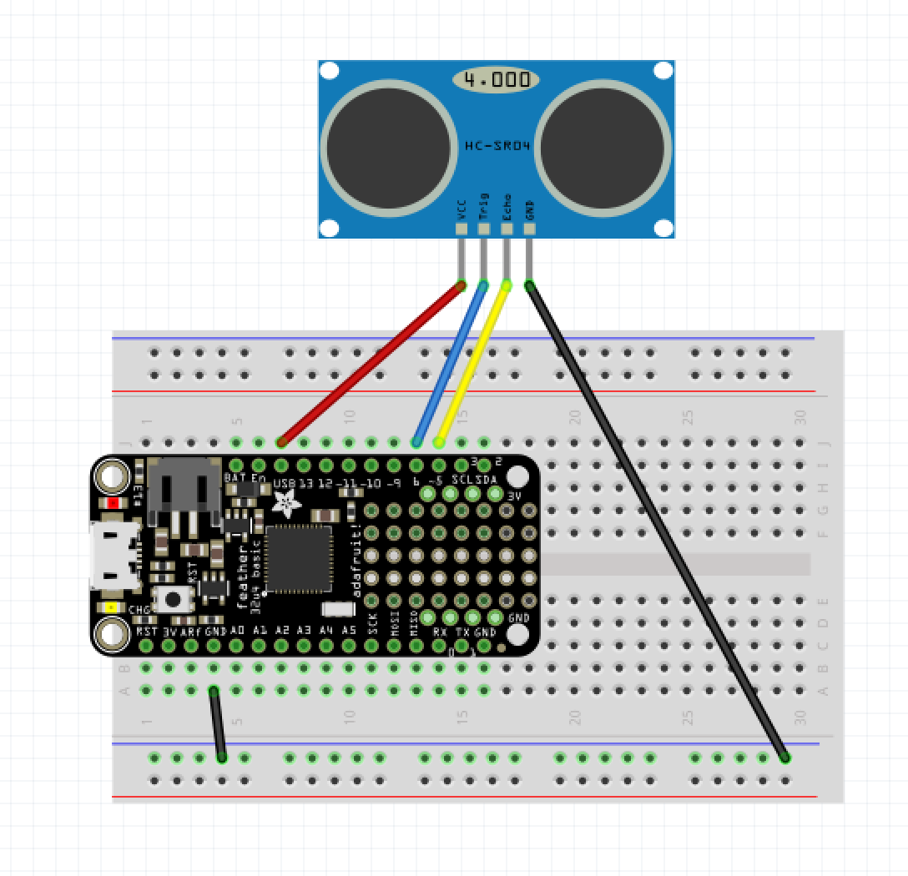

# Using the Feather 32u4 with the HC-SR04 Proximity Sensor



The HC-SR04 Proximity sensor uses ultrasound pulses and echos to detect the presence of objects from 2cm to 400cm. In reality the range seems to be much shorter than that. And the accuracy of the measurement depends in large part on how large of an object you are trying to detect. For large objects like walls you will be able to get more accurate measurements, for smaller things the range will be shorter.


The HC-SR04 gets triggered by a ten microsecond high  signal on the trigger pin. Once it gets pulled low again, the module  sends out eight 40kHz sound pulses. If an object is present in the  detection range, the sound pulses get reflected by that object, and the  module receives the echo. The time between sending the eight pulses and  receiving the echo can be used to calculate the distance to the object that reflected the sound.

Checking how long the echo pin of the module is high calculates the measured distance. 

In our code, we use the [`delayMicroseconds`](https://www.arduino.cc/reference/en/language/functions/time/delaymicroseconds/) function to initiate the pulse, and the [`pulseIn`](https://www.arduino.cc/reference/en/language/functions/advanced-io/pulsein/) function to get the time between the pulse and the echo. 

Once we have the echo time, there is a formula that must be applied to convert to a usable unit like centimeters.

In the code below, there is an if statement that prints "Out of range" when the value is less than 0 or more than 200, this should help eliminate some erratic and invalid values. To use this code in a real project, you would want to use the value of `distance` when it is between 0 and 200. Look at the [proximity_blinker](https://github.com/UCLAdmaFABLAB/electronics-examples/blob/trunk/Using%20the%20HC-SR04%20Proximity%20Sensor/proximity_blinker/proximity_blinker.ino) example for more.

```c
const int TRIGGER_PIN = 6;
const int ECHO_PIN = 5;

void setup() {
  Serial.begin(9600);
  pinMode(TRIGGER_PIN, OUTPUT);
  pinMode(ECHO_PIN, INPUT);
}

void loop() {
  digitalWrite(TRIGGER_PIN, LOW);
  delayMicroseconds(2);
  digitalWrite(TRIGGER_PIN, HIGH);
  delayMicroseconds(10);
  digitalWrite(TRIGGER_PIN, LOW);
  long duration = pulseIn(ECHO_PIN, HIGH);
  long distance = (duration / 2) / 29.1;

  if (distance >= 200 || distance <= 0) {
    Serial.println("Out of range");
  } else {
    Serial.print(distance);
    Serial.println(" cm");
  }

  delay(100);
}
```
